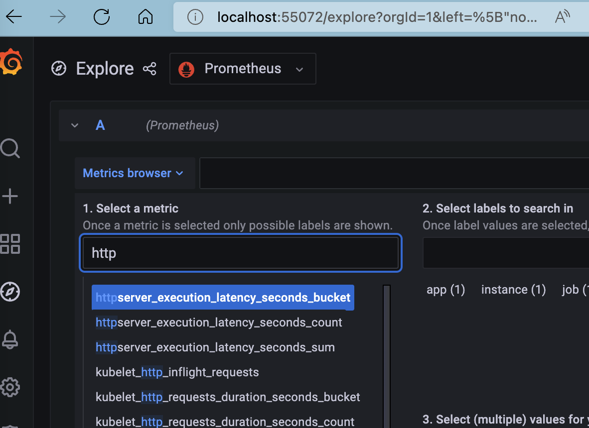
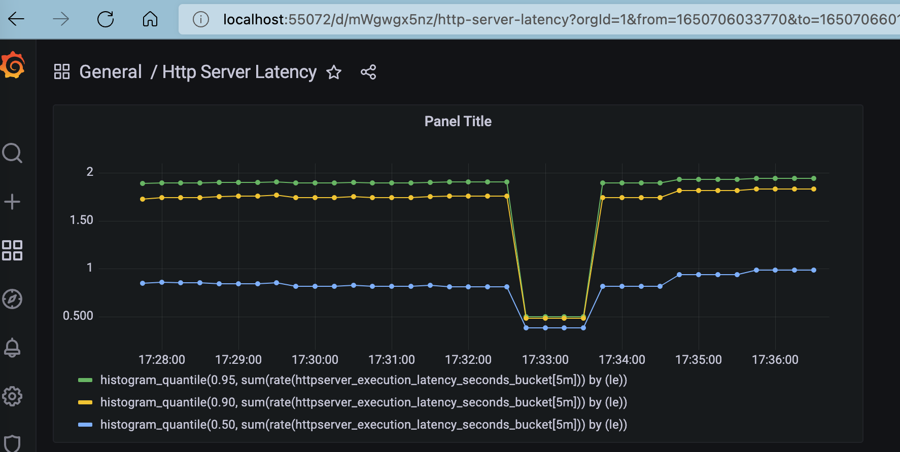

### 作业要求
>
为 HTTPServer 添加 0-2 秒的随机延时；
为 HTTPServer 项目添加延时 Metric；
将 HTTPServer 部署至测试集群，并完成 Prometheus 配置；
从 Promethus 界面中查询延时指标数据；
（可选）创建一个 Grafana Dashboard 展现延时分配情况。
提交地址： https://jinshuju.net/f/awEgbi
截止日期：2022 年 4 月 24 日 23:59
>


1. 通过makefile build好image，部署deplotment； 具体代码在：https://github.com/linkinlxm/cncamp/tree/main/exercise/10.1/app
2. 部署loki-grafana
```
helm upgrade --install loki grafana/loki-stack --set grafana.enabled=true,prometheus.enabled=true,prometheus.alertmanager.persistentVolume.enabled=false,prometheus.server.persistentVolume.enabled=false
WARNING: Kubernetes configuration file is group-readable. This is insecure. Location: /Users/lxm/.kube/gke.config
WARNING: Kubernetes configuration file is world-readable. This is insecure. Location: /Users/lxm/.kube/gke.config
Release "loki" does not exist. Installing it now.
W0423 17:20:44.401804   51310 warnings.go:70] policy/v1beta1 PodSecurityPolicy is deprecated in v1.21+, unavailable in v1.25+
W0423 17:20:44.501548   51310 warnings.go:70] policy/v1beta1 PodSecurityPolicy is deprecated in v1.21+, unavailable in v1.25+
W0423 17:20:44.602263   51310 warnings.go:70] policy/v1beta1 PodSecurityPolicy is deprecated in v1.21+, unavailable in v1.25+
W0423 17:20:44.704561   51310 warnings.go:70] policy/v1beta1 PodSecurityPolicy is deprecated in v1.21+, unavailable in v1.25+
W0423 17:20:52.415216   51310 warnings.go:70] policy/v1beta1 PodSecurityPolicy is deprecated in v1.21+, unavailable in v1.25+
W0423 17:20:52.415216   51310 warnings.go:70] policy/v1beta1 PodSecurityPolicy is deprecated in v1.21+, unavailable in v1.25+
W0423 17:20:52.462775   51310 warnings.go:70] policy/v1beta1 PodSecurityPolicy is deprecated in v1.21+, unavailable in v1.25+
W0423 17:20:52.462776   51310 warnings.go:70] policy/v1beta1 PodSecurityPolicy is deprecated in v1.21+, unavailable in v1.25+
NAME: loki
LAST DEPLOYED: Sat Apr 23 17:20:43 2022
NAMESPACE: default
STATUS: deployed
REVISION: 1
NOTES:
The Loki stack has been deployed to your cluster. Loki can now be added as a datasource in Grafana.

See http://docs.grafana.org/features/datasources/loki/ for more detail.
```

3. 通过命令行(via ab)不断访问/hello，（把pod的端口forward到本地访问）
```
ab -n 10 http://localhost:52428/hello
This is ApacheBench, Version 2.3 <$Revision: 1879490 $>
Copyright 1996 Adam Twiss, Zeus Technology Ltd, http://www.zeustech.net/
Licensed to The Apache Software Foundation, http://www.apache.org/

Benchmarking localhost (be patient).....done


Server Software:
Server Hostname:        localhost
Server Port:            52428

Document Path:          /hello
Document Length:        107 bytes

Concurrency Level:      1
Time taken for tests:   22.904 seconds
Complete requests:      10
Failed requests:        0
Total transferred:      2250 bytes
HTML transferred:       1070 bytes
Requests per second:    0.44 [#/sec] (mean)
Time per request:       2290.415 [ms] (mean)
Time per request:       2290.415 [ms] (mean, across all concurrent requests)
Transfer rate:          0.10 [Kbytes/sec] received

Connection Times (ms)
              min  mean[+/-sd] median   max
Connect:        0    0   0.0      0       0
Processing:  1329 2290 521.5   2596    3021
Waiting:      328 1292 530.9   1589    2049
Total:       1329 2290 521.5   2596    3021

Percentage of the requests served within a certain time (ms)
  50%   2596
  66%   2603
  75%   2649
  80%   2763
  90%   3021
  95%   3021
  98%   3021
  99%   3021
 100%   3021 (longest request)

```

4. 获取loki-grafana密码

```
Login password is in secret loki-grafana

kubectl get secret loki-grafana -oyaml -n default
Find admin-password: xxx

echo 'xxx' | base64 -d
Then you will get grafana login password, the login username is 'admin' on default.

```

5. 登录grafana，explore看有没有能收集到metric，可以看到正常收集到了metric； 然后导入孟老师的dashboard模版（[golang/httpserver-latency.json at metrics · cncamp/golang (github.com)](https://github.com/cncamp/golang/blob/metrics/httpserver/grafana-dashboard/httpserver-latency.json)）





