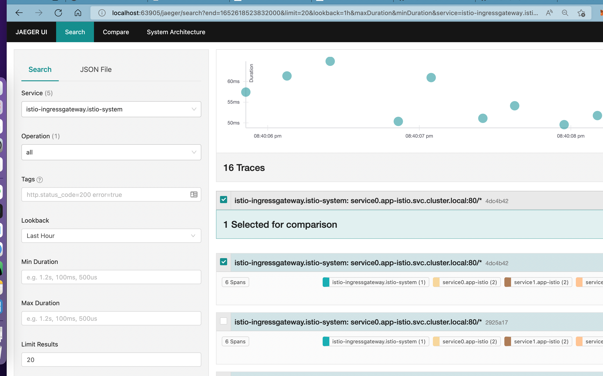

## 作业要求
> 把我们的 httpserver 服务以 Istio Ingress Gateway 的形式发布出来。以下是你需要考虑的几点：
> - 如何实现安全保证；
> - 七层路由规则；
> - 考虑 open tracing 的接入。

## 按照istioctl
我机器是mac，直接用brew安装
```
brew install istioctl
```

## 安装istio到集群
```
istioctl install --set profile=demo -y
✔ Istio core installed
✔ Istiod installed
✔ Ingress gateways installed
✔ Egress gateways installed
✔ Installation complete                                                                                            Making this installation the default for injection and validation.

Thank you for installing Istio 1.13.  Please take a few minutes to tell us about your install/upgrade experience!  https://forms.gle/pzWZpAvMVBecaQ9h9
```
## 创建新的nasmespace并且开启istio注入
```
kubectl create ns app-istio
kubectl label ns app-istio istio-injection=enabled
```

## 创建通配符证书到istio-system
```
apiVersion: cert-manager.io/v1
kind: Certificate
metadata:
  name: wildcard-liljackson-xyz
  namespace: istio-system
spec:
  dnsNames:
    - '*.liljackson.xyz' # 要签发证书的域名
  issuerRef:
    kind: ClusterIssuer
    name: letsencrypt-liljackson-cluster-issuer # 引用 Issuer，指示采用 http01 方式进行校验
  secretName: wildcard-liljackson-xyz-tls # 最终签发出来的证书会保存在这个 Secret 里面
```
## 部署servic0，1，2
代码在每次请求下一个地址同时，会把header也一并全部转发，实现后面的tracing
```
kubectl apply -f service0.yaml -n app-istio
kubectl apply -f service1.yaml -n app-istio
kubectl apply -f service2.yaml -n app-istio
```

## 部署istio VirtualService，Gateways

```
kubectl apply -f istio-spec.yaml
k get virtualservice -n app-istio
NAME       GATEWAYS       HOSTS                           AGE
service0   ["service0"]   ["httpserver.liljackson.xyz"]   36m
k get gateway -n app-istio
NAME       AGE
service0   36m
```

## 部署jaeger
```
kubectl apply -f jaeger-spec.yaml
```
## 测试访问
```
curl https://httpserver.liljackson.xyz
===================Details of the http request header:============
HTTP/1.1 200 OK
Transfer-Encoding: chunked
Content-Type: text/plain; charset=utf-8
Date: Sun, 15 May 2022 12:11:34 GMT
Server: envoy
X-Envoy-Upstream-Service-Time: 57

2eb
===================Details of the http request header:============
HTTP/1.1 200 OK
Content-Length: 669
Content-Type: text/plain; charset=utf-8
Date: Sun, 15 May 2022 12:11:34 GMT
Server: envoy
X-Envoy-Upstream-Service-Time: 26

===================Details of the http request header:============
X-Envoy-Attempt-Count=[1]
X-Forwarded-Proto=[https]
X-B3-Traceid=[d9d8c699b144132683dc94698a241993]
User-Agent=[Go-http-client/1.1,Go-http-client/1.1,curl/7.71.1]
Accept=[*/*]
Accept-Encoding=[gzip,gzip]
X-Request-Id=[b7c02c3c-e8f1-9b6a-b8bb-42b5127414be]
X-B3-Parentspanid=[95ab97957dc453f9]
X-B3-Sampled=[1]
X-Envoy-Internal=[true]
X-Forwarded-Client-Cert=[By=spiffe://cluster.local/ns/app-istio/sa/default;Hash=40be3968258fe6508cb7acad37a3ced
9d
302b14eb4333756d2a0354911ecc70ee0;Subject="";URI=spiffe://cluster.local/ns/app-istio/sa/default]
X-B3-Spanid=[9a316e93d1e14e96]
X-Forwarded-For=[10.112.0.1]

0
```

访问jaeger

istioctl dashboard jaeger

自动打开浏览器到jaeger dashboard


